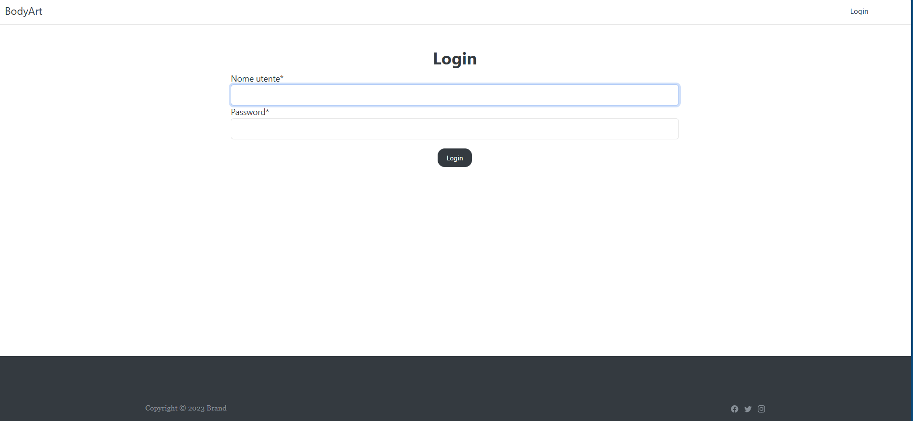
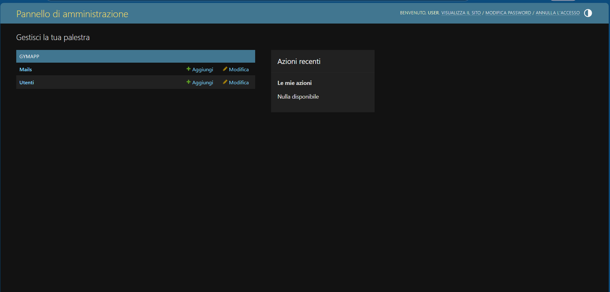
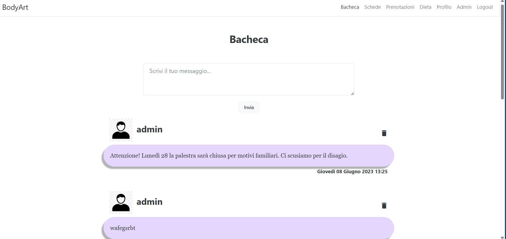
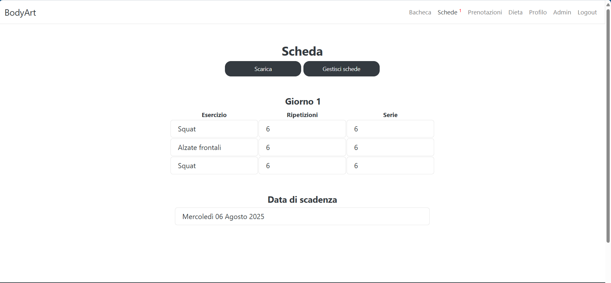
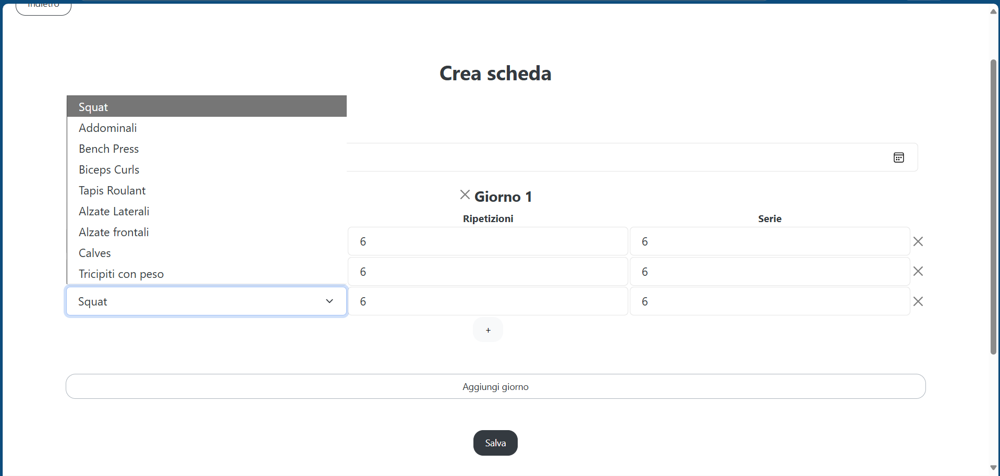
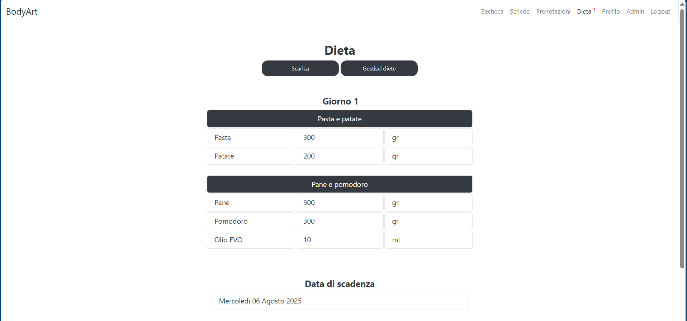
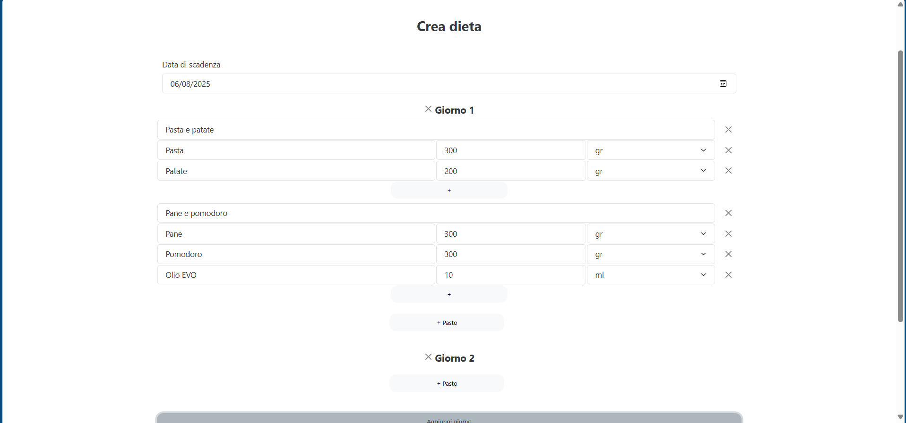
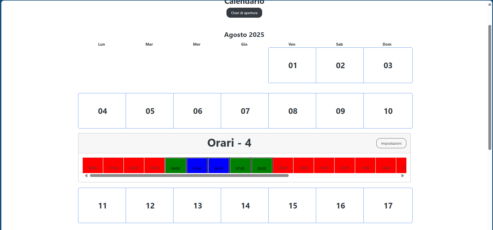
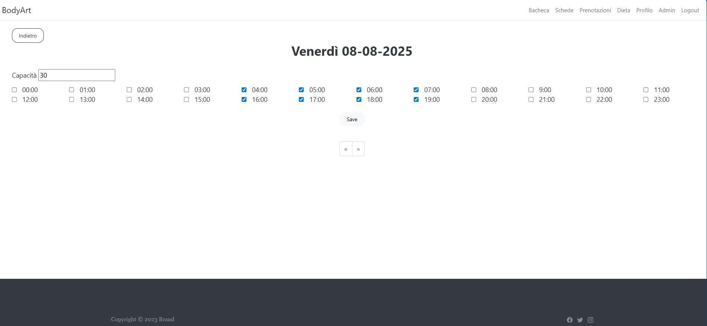

# GymApp
## 🇮🇹 Italiano

**Disclaimer**: applicazione fatta per l'esame di _Tecnologie Web_, nel terzo anno della facoltà triennale di _Ingegneria Informatica_ di _UniMoRe_.  

_Gym App_ è una webapp ideata per la gestione dei servizi legati alla palestra. E' stata ideata per essere gestita direttamente dal personale della palestra che avrebbe offerto ai propri clienti una serie di servizi personalizzati.
Una lista non esaustiva di compiti implementati da questo programma:
* **Sistema di autenticazione**: è possibile autenticarsi nell sito come utenti o come staffer. Gli account degli utenti possono essere creati esclusivamente dagli staffer nell'apposito pannello di controllo.
  

    
  

  

    
  

* **Bacheca degli annunci**: gli staffer possono pubblicare messaggi in una bacheca pubblica e gli utenti della palestra possono visualizzarli.
  

    
  

* **Schede di allenamento**: gli staffer possono creare delle schede di allenamento personalizzato per gli utenti, e questi ultimi possono consultarli in tempo reale.
  

    
  

    

    
  

* **Piani alimentari**: gli staffer possono creare dei piani alimentari di allenamento personalizzato per gli utenti, e questi ultimi possono consultarli in tempo reale.
  

    
  

  

    
  

* **Gestione prenotazioni**: gli staffer possono gestire le prenotazini degli slot in palestra, impostando un limite massimo di utenti e gli orari in cui possono prenotarsi.
  

    
  

  

    
  

### 🛠 Tecnologie utilizzate
- Python: codice di base.
- Python/Django: per le API di webapp e ORM management.
---
## 🇬🇧 English

**Disclaimer**: This application was developed for the _Web Technologies_ exam during the third year of the Bachelor's degree in _Computer Engineering_ at _UniMoRe_.

_Gym App_ is a web application designed to manage services related to gym activities. It was created to be used directly by gym staff, who can offer their clients a range of personalized services.  
Below is a non-exhaustive list of features implemented in the app:

* **Authentication System**: Users can log into the website either as regular users or staff members. User accounts can only be created by staff members through a dedicated admin panel.
  

    
  

  

    
  

* **Bulletin Board**: Staff members can post messages on a public bulletin board, which gym users can view.
  

    
  

* **Workout Plans**: Staff can create personalized workout plans for users, who can access them in real time.
  

    
  

  

    
  

* **Meal Plans**: Staff can create personalized meal plans for users, which can also be accessed in real time.
  

    
  

  

    
  

* **Booking Management**: Staff can manage gym slot bookings, setting a maximum number of users and available time slots.
  

    
  

  

    
  

### 🛠 Technologies Used
- Python: core logic.
- Python/Django: for the webapp APIs and ORM management.

---
# Software utilizzato:
- Python 3.8
- Django
- Pycharm

# Guida all'installazione:
- Clonare la repository o estrarla dallo zip in un percorso a propria scelta
- Aprire il progetto con Pycharm
- Creare un nuovo venv con interprete Python 3.8, utilizzando pipenv.
- Passare al terminale di Pycharm e installare Django:
- - `pipenv install Django`
- Installare le seguenti librerie:
- - `pipenv install django-bootstrap4`
- - `pipenv install django-crispy-forms`
- - `pipenv install Pillow`
- - `pipenv install pdfkit`
- Quindi procedere con la creazione del database con i seguenti comandi:
- - `python manage.py migrate`
- Per avviare il server, eseguire il seguente comando dal terminale di Pycharm:
- - `python manage.py runserver`
- Per creare un superuser, eseguire il seguente comando dal terminale di Pycharm:
- - `python manage.py createsuperuser`
- - Inserire username, email e password
- Per accedere al sito, aprire il browser e digitare:
- - `localhost:8000`
